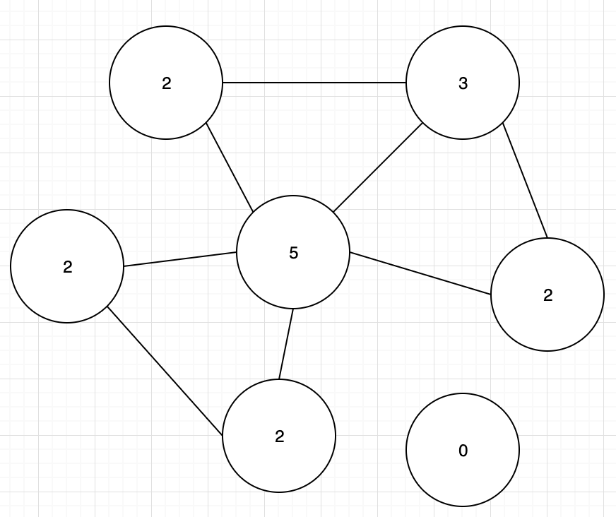

## CSC 501: Algorithms and Data Models

1. Draw a graph with a degree distribution of: <5, 3, 2, 2, 2, 2, 0>.
<br>

2. You are given the following relation:

Subject | Predicate | Object
:--- | :--- | :---
Xi Jinping | PresidentOf | China
Xi Mingze | isDaughterTo | Xi Jinping
Xi Jinping | isFatherTo | Xi Mingze
Xi Mingze | BornIn | Fujian
Fujian | CityIn | China
Xi Jinping | LeaderOf | Communist Party of China (CPC)
Communist Party of China (CPC) | PoliticalPartyOf | China
Xi Mingze | StudiedAt | Zhejiang University
Xi Mingze | StudiedAt | Harvard University
Zhejiang University | LocatedIn | Hangzhou
Harvard University | LocatedIn | Boston
Boston | CityIn | United States of America (USA)
Hangzhou | CityIn | China

(a) Represent the relation as a (knowledge) graph

b) Show the paths matched by the following conjunctive pattern matching query:
```
x `CityIn' y ∧ w `LocatedIn' x ∧ `Mingze' v w
```
